# banana_slam

**Extended Kalman Filter / ICP Odometry / SLAM for Mobile Robotics**


<p align="center">
  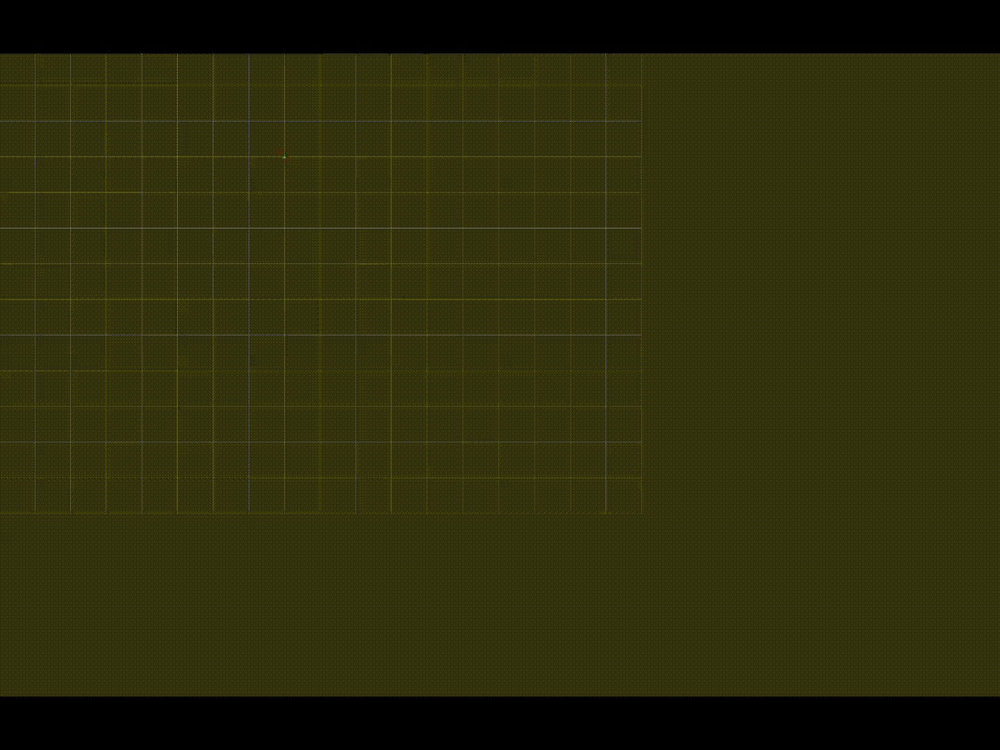
</p>

<p align="center"><em>Real-time SLAM demonstration with autonomous mapping and localization</em></p>

## Overview

This project implements and compares three progressive localization approaches for mobile robotics as part of **FRA532 Mobile Robotics** coursework. Using real TurtleBot3 sensor data, we build from basic sensor fusion to full SLAM with loop closure, analyzing trade-offs between accuracy, robustness, and computational efficiency.

**Three-Stage Implementation:**
1. **Part 1: EKF Odometry Fusion** - Wheel odometry + IMU sensor fusion using Extended Kalman Filter
2. **Part 2: ICP Odometry Refinement** - Adaptive scan-to-map matching with quality-based fusion to assist EKF
3. **Part 3: Full SLAM** - Global loop closure and occupancy grid mapping using SLAM Toolbox

## Table of Contents

**Project Context**
- [Overview](#overview)

**Getting Started**
- [Setup & Installation](#setup)
- [Dataset Description](#dataset-description)
- [Running the System](#running-the-system)

**Core Algorithms**
- [Part 1: EKF Odometry Fusion](#part-1-ekf-odometry-fusion)
- [Part 2: ICP Odometry Refinement](#part-2-icp-odometry-refinement)
- [Part 3: Full SLAM with slam_toolbox](#part-3-full-slam-with-slam_toolbox)

**Results & Analysis**
- [Results and Visualization](#results-and-visualization)
- [Algorithm Comparison Analysis](#algorithm-comparison-analysis)
- [Conclusion](#conclusion)

**Practical Guides**
- [Parameter Tuning Guide](#parameter-tuning-guide)
- [Troubleshooting Common Issues](#troubleshooting-common-issues)
- [RViz Visualization Setup](#rviz-visualization-setup)
- [Performance Optimization Tips](#performance-optimization-tips)
- [Advanced Usage Examples](#advanced-usage-examples)

---

## Setup

### System Requirements

**Operating System:**
- Ubuntu 22.04 LTS (Jammy Jellyfish)

**ROS 2 Version:**
- ROS 2 Humble Hawksbill

**Hardware:**
- Minimum 4GB RAM (8GB recommended)
- 10GB free disk space
- Intel Core i5 or equivalent (for real-time performance)

**Python Version:**
- Python 3.10 or later

### Installation

#### Step 1: Install ROS 2 Humble

If ROS 2 Humble is not already installed, follow these steps:

```bash
# Set locale
locale
sudo apt update && sudo apt install locales
sudo locale-gen en_US en_US.UTF-8
sudo update-locale LC_ALL=en_US.UTF-8 LANG=en_US.UTF-8
export LANG=en_US.UTF-8

# Setup sources
sudo apt install software-properties-common
sudo add-apt-repository universe
sudo apt update && sudo apt install curl -y
sudo curl -sSL https://raw.githubusercontent.com/ros/rosdistro/master/ros.key -o /usr/share/keyrings/ros-archive-keyring.gpg
echo "deb [arch=$(dpkg --print-architecture) signed-by=/usr/share/keyrings/ros-archive-keyring.gpg] http://packages.ros.org/ros2/ubuntu $(. /etc/os-release && echo $UBUNTU_CODENAME) main" | sudo tee /etc/apt/sources.list.d/ros2.list > /dev/null

# Install ROS 2 Humble Desktop
sudo apt update
sudo apt upgrade
sudo apt install ros-humble-desktop

# Install development tools
sudo apt install ros-dev-tools

# Source ROS 2
echo "source /opt/ros/humble/setup.bash" >> ~/.bashrc
source ~/.bashrc
```

**Verify ROS 2 installation:**
```bash
ros2 --version
# Should output: ros2 cli version 0.x.x
```

#### Step 2: Install Required ROS 2 Packages

```bash
# Install SLAM Toolbox (for mapping and loop closure)
sudo apt install ros-humble-slam-toolbox

# Install Navigation2 (for map server and navigation stack)
sudo apt install ros-humble-navigation2
sudo apt install ros-humble-nav2-map-server
sudo apt install ros-humble-nav2-bringup

# Install ROS 2 bag tools (for recording and playback)
sudo apt install ros-humble-rosbag2-storage-default-plugins
sudo apt install ros-humble-rosbag2-storage-mcap

# Install TF2 tools (for coordinate frame transformations)
sudo apt install ros-humble-tf2-tools
sudo apt install ros-humble-tf-transformations

# Install RViz2 (if not included in desktop installation)
sudo apt install ros-humble-rviz2

# Install additional sensor message types
sudo apt install ros-humble-sensor-msgs
sudo apt install ros-humble-nav-msgs
sudo apt install ros-humble-geometry-msgs
```

**Verify SLAM Toolbox installation:**
```bash
# Check if SLAM Toolbox package exists
ros2 pkg list | grep slam_toolbox
# Should output: slam_toolbox

# Check available SLAM Toolbox nodes
ros2 pkg executables slam_toolbox
# Should output multiple executables including:
#   slam_toolbox async_slam_toolbox_node
#   slam_toolbox sync_slam_toolbox_node
#   slam_toolbox online_async_launch.py

# Verify SLAM Toolbox version
ros2 pkg prefix slam_toolbox
# Should output: /opt/ros/humble

# Test SLAM Toolbox launch files
ros2 launch slam_toolbox online_async_launch.py --show-args
# Should display available launch arguments without errors
```

#### Step 3: Install Python Dependencies

```bash
# Install pip if not already installed
sudo apt install python3-pip

# Install NumPy
pip3 install numpy

# Install SciPy (for KD-tree)
pip3 install scipy

# Install Matplotlib (for visualization)
pip3 install matplotlib

# Install PyYAML (for configuration)
pip3 install pyyaml

# Install transforms3d (for quaternion conversions)
pip3 install transforms3d

# Install Pandas (for data analysis)
pip3 install pandas
```

#### Step 4: Create and Build Workspace

```bash
# Create workspace directory
mkdir -p ~/Desktop/mobile/banana_slam
cd ~/Desktop/mobile/banana_slam

# Clone or copy your source code to src/
# (Assuming source code is already in src/)

# Install dependencies using rosdep
sudo rosdep init  # Only if you haven't initialized rosdep before
rosdep update
rosdep install --from-paths src --ignore-src -r -y

# Build workspace
colcon build --symlink-install

# Source workspace
source install/setup.bash

# Add to bashrc for automatic sourcing (optional)
echo "source ~/Desktop/mobile/banana_slam/install/setup.bash" >> ~/.bashrc
```

**Build output verification:**
```bash
# Should see successful build messages like:
# Summary: 2 packages finished [X.XXs]
#   banana_odom
#   icp_odometry
```

#### Step 5: Verify Installation

```bash
# Check if packages are found
ros2 pkg list | grep banana
# Should output:
# banana_odom
# icp_odometry

# Check available launch files
ros2 launch banana_odom --show-args full_odom_launch.py
# Should display available arguments

# List available nodes
ros2 pkg executables banana_odom
# Should show: ekf_node, trajectory_plotter, etc.

ros2 pkg executables icp_odometry
# Should show: icp_odometry_node, lidar_filter_node
```

### Troubleshooting Installation

**Issue: rosdep command not found**
```bash
sudo apt install python3-rosdep
sudo rosdep init
rosdep update
```

**Issue: colcon command not found**
```bash
sudo apt install python3-colcon-common-extensions
```

**Issue: Missing Python packages**
```bash
# Install all Python dependencies at once
pip3 install numpy scipy matplotlib pyyaml transforms3d pandas
```

**Issue: Package not found after build**
```bash
# Make sure to source the workspace
source ~/Desktop/mobile/banana_slam/install/setup.bash

# Verify ROS_PACKAGE_PATH
echo $AMENT_PREFIX_PATH
# Should include your workspace path
```

**Issue: scipy.spatial.KDTree import error**
```bash
# Ensure scipy is installed for Python 3
pip3 install --upgrade scipy
python3 -c "from scipy.spatial import KDTree; print('KDTree OK')"
```

**Issue: SLAM Toolbox not found**
```bash
# Verify SLAM Toolbox installation
ros2 pkg list | grep slam_toolbox

# If not found, install SLAM Toolbox
sudo apt update
sudo apt install ros-humble-slam-toolbox

# Verify installation
ros2 pkg executables slam_toolbox
```

**Issue: SLAM Toolbox fails to start**
```bash
# Check if required topics exist when running with bag file
ros2 topic list
# Should see /scan (or /scan_filtered), /odom, /tf

# Verify clock is published when using bag playback
ros2 topic echo /clock
# Should show incrementing timestamps

# Ensure use_sim_time parameter is set correctly
ros2 param get /slam_toolbox use_sim_time
# Should return: Boolean value is: True (when playing bags)

# Check SLAM Toolbox logs for errors
ros2 run slam_toolbox async_slam_toolbox_node --ros-args -p use_sim_time:=true
```

**Issue: Map not saving**
```bash
# Verify nav2_map_server is installed
ros2 pkg list | grep nav2_map_server

# If not found, install
sudo apt install ros-humble-nav2-map-server

# Test map saving manually
ros2 run nav2_map_server map_saver_cli -f test_map
# Should create test_map.pgm and test_map.yaml
```

**Issue: TF transform errors**
```bash
# Check TF tree structure
ros2 run tf2_tools view_frames
evince frames.pdf

# Verify required transforms exist:
# - map -> odom (published by SLAM Toolbox)
# - odom -> base_footprint (published by ekf_node)
# - base_footprint -> laser (static transform)

# Check transform publication
ros2 topic echo /tf --field transforms
ros2 topic echo /tf_static --field transforms
```

### Dataset Description

The dataset is provided as ROS 2 bag files and contains sensor measurements recorded during robot motion in indoor environments.

**Topics included:**
- `/scan`: 2D LiDAR laser scans at 5 Hz (with timing jitter despite filtering)
- `/imu`: Gyroscope and accelerometer data at 20 Hz
- `/joint_states`: Wheel motor position and velocity at 20 Hz

**Sensor Limitations:**
- **LiDAR timing jitter**: 5 Hz nominal rate with irregular intervals affecting scan alignment
- **Dynamic objects**: Moving people/obstacles in environment even with filtering enabled
- **Glass surfaces**: Transparent doors cause sparse/missing point clouds in certain areas
- **No ground truth**: Position/heading accuracy assessed through SLAM consistency, not absolute truth

The dataset is divided into three sequences with varying difficulty levels:

1. **Sequence 00 – Empty Hallway (WORST PERFORMANCE):**
   - Long straight corridor with minimal geometric features
   - Glass doors cause severe point cloud sparsity and missing data
   - Insufficient features for reliable ICP matching
   - Represents most challenging scenario for scan-based odometry

2. **Sequence 01 – Non-Empty Hallway with Sharp Turns (BETTER PERFORMANCE):**
   - More obstacles and clutter provide geometric diversity
   - Sharp turns and aggressive maneuvers challenge motion model
   - Improved feature availability compared to seq00
   - Wheel slip during aggressive motion affects accuracy

3. **Sequence 02 – Non-Empty Hallway with Smooth Motion (BEST PERFORMANCE):**
   - Rich geometric features from obstacles and structured environment
   - Smooth, stable motion reduces prediction errors
   - Best feature availability for ICP matching
   - Optimal conditions for scan-to-map alignment

| Sequence | Environment | Duration | Distance | Performance Rank | Key Challenges |
|----------|-------------|----------|----------|------------------|----------------|
| seq00 | Empty hallway | 525s | 58m | **Worst** (3rd) | Glass doors, sparse features, no landmarks |
| seq01 | Sharp turns + obstacles | 393s | 62m | **Better** (2nd) | Aggressive motion, wheel slip |
| seq02 | Smooth motion + obstacles | 599s | 60m | **Best** (1st) | Minimal challenges, rich features |

### Building the Workspace

```bash
# Navigate to workspace
cd /home/zenter/Desktop/mobile/banana_slam

# Install dependencies
rosdep install --from-paths src --ignore-src -r -y

# Build workspace
colcon build --symlink-install

# Source workspace
source install/setup.bash

# Add to bashrc (optional)
echo "source ~/Desktop/mobile/banana_slam/install/setup.bash" >> ~/.bashrc
```

### Running the System

**Terminal 1: Play ROS Bag**
```bash
cd /home/zenter/Desktop/mobile

# Sequence 00 - Empty Hallway
ros2 bag play FRA532_LAB/FRA532_LAB1_DATASET/fibo_floor3_seq00 --clock

# Sequence 01 - Sharp Turns
ros2 bag play FRA532_LAB/FRA532_LAB1_DATASET/fibo_floor3_seq01 --clock

# Sequence 02 - Smooth Motion
ros2 bag play FRA532_LAB/FRA532_LAB1_DATASET/fibo_floor3_seq02 --clock
```

**Terminal 2: Launch Odometry Pipeline**
```bash
cd /home/zenter/Desktop/mobile/banana_slam
source install/setup.bash

# Part 1: EKF only (Wheel + IMU)
ros2 launch banana_odom ekf_launch.py

# Part 2: EKF + ICP (Wheel + IMU + LiDAR)
ros2 launch banana_odom full_odom_launch.py use_sim_time:=true

# Part 3: EKF + ICP + SLAM
ros2 launch banana_odom full_slam_launch.py use_sim_time:=true
```

---

## Part 1: EKF Odometry Fusion

This section presents a sensor fusion approach combining wheel odometry and IMU orientation using an Extended Kalman Filter (EKF). The wheel odometry provides position and velocity estimates through encoder measurements, while the IMU supplies heading corrections to compensate for accumulated drift.

### 1.1 Wheel Odometry

#### 1.1.1 Robot Parameters

The TurtleBot3 Burger robot is a differential drive platform with the following parameters:

| Parameter | Symbol | Value | Description |
|-----------|--------|-------|-------------|
| Wheel radius | r | 0.033 m | Radius of drive wheels |
| Track width | b | 0.160 m | Distance between left and right wheel centers |

#### 1.1.2 Wheel Displacement

The wheel displacements are obtained directly from the `/joint_states` topic, which provides **angular displacement** in radians. These are converted to linear distance by multiplying by wheel radius:

$$\Delta s_r = [\text{position}_r(t) - \text{position}_r(t-1)] \times r$$
$$\Delta s_l = [\text{position}_l(t) - \text{position}_l(t-1)] \times r$$

where $\Delta s_r$ and $\Delta s_l$ represent the **linear displacement** (in meters) of the right and left wheels, and $r$ is the wheel radius.

**Note:** The TurtleBot3 `/joint_states` topic provides:
- `position`: Angular displacement (radians) - multiply by wheel_radius to get linear distance
- `velocity`: Linear velocity (m/s) - already in linear form, can be used directly

#### 1.1.3 ICR (Instantaneous Center of Rotation) Kinematics

For differential drive robots, the ICR method provides accurate pose integration by computing the instantaneous turning center. This approach is more accurate than simple linear approximation, especially during turning maneuvers.

**Heading change:**

$$\Delta \theta = \frac{\Delta s_r - \Delta s_l}{b}$$

**Turning radius:**

$$R = \frac{b}{2} \cdot \frac{\Delta s_l + \Delta s_r}{\Delta s_r - \Delta s_l}$$

**Position update:**

For curved motion ($\Delta \theta \neq 0$):
$$\Delta x = R \cdot \sin(\Delta \theta) = \frac{\Delta s_l + \Delta s_r}{2} \cdot \frac{\sin(\Delta \theta)}{\Delta \theta}$$
$$\Delta y = R \cdot (1 - \cos(\Delta \theta)) = \frac{\Delta s_l + \Delta s_r}{2} \cdot \frac{1 - \cos(\Delta \theta)}{\Delta \theta}$$

For straight-line motion ($\Delta \theta \approx 0$):
$$\Delta x = \frac{\Delta s_l + \Delta s_r}{2}$$
$$\Delta y = 0$$

**Simplified implementation** (arc midpoint approximation):
$$\Delta s = \frac{\Delta s_l + \Delta s_r}{2}$$
$$\Delta x = \Delta s \cdot \cos(\theta + \frac{\Delta \theta}{2})$$
$$\Delta y = \Delta s \cdot \sin(\theta + \frac{\Delta \theta}{2})$$

This approximation evaluates the robot's orientation at the midpoint of the arc, providing good accuracy for small time steps.

#### 1.1.4 Robot Velocity

The robot's linear and angular velocities are computed as:

$$v = \frac{\Delta s}{\Delta t}, \quad \omega = \frac{\Delta \theta}{\Delta t}$$

where $\Delta t$ is the time interval between encoder measurements.

### 1.2 Extended Kalman Filter

#### 1.2.1 State Vector Design

The EKF state vector represents the robot's pose in the odometry frame:

$$\mathbf{x} = \begin{bmatrix} x \\ y \\ \theta \end{bmatrix}$$

where:
- $x, y$: Position in the odometry frame (meters)
- $\theta$: Heading angle (radians)

**Alternative consideration:** A 6-state vector $[x, y, \theta, v_x, v_y, \omega]$ could include velocity components, but the 3-state formulation is simpler and sufficient for differential drive odometry where velocities are directly computed from wheel encoders.

#### 1.2.2 Motion Model (Prediction)

The motion model propagates the state based on wheel odometry measurements:

**State transition function:**
$$\mathbf{x}_{t} = g(\mathbf{x}_{t-1}, \mathbf{u}_t) = \begin{bmatrix}
x + \Delta x \\
y + \Delta y \\
\theta + \Delta \theta
\end{bmatrix}$$

where the control input $\mathbf{u}_t = [v, \omega]^T$ is derived from wheel encoders.

**Jacobian of motion model:**

The Jacobian matrix linearizes the nonlinear motion model around the current state:

$$\mathbf{F}_t = \frac{\partial g}{\partial \mathbf{x}} = \begin{bmatrix}
1 & 0 & -\Delta s \sin(\theta + \frac{\Delta \theta}{2}) \\
0 & 1 & \Delta s \cos(\theta + \frac{\Delta \theta}{2}) \\
0 & 0 & 1
\end{bmatrix}$$

**Covariance prediction:**
$$\mathbf{P}_t = \mathbf{F}_t \mathbf{P}_{t-1} \mathbf{F}_t^T + \mathbf{Q}$$

where $\mathbf{Q}$ is the process noise covariance matrix.

#### 1.2.3 Measurement Model (Correction)

The IMU provides heading measurements to correct accumulated wheel odometry drift:

**Measurement function:**
$$\mathbf{z}_t = h(\mathbf{x}_t) + \mathbf{v}_t = \theta + \mathbf{v}_t$$

where $\mathbf{v}_t \sim \mathcal{N}(0, \mathbf{R})$ is measurement noise.

**Measurement Jacobian:**
$$\mathbf{H} = \frac{\partial h}{\partial \mathbf{x}} = \begin{bmatrix} 0 & 0 & 1 \end{bmatrix}$$

**Measurement error term:**
$$\mathbf{y}_t = \mathbf{z}_t - h(\bar{\mathbf{x}}_t) = \mathbf{z}_t - \bar{\theta}_t$$

**Measurement error term covariance:**
$$\mathbf{S}_t = \mathbf{H} \bar{\mathbf{P}}_t \mathbf{H}^T + \mathbf{R}$$

**Kalman gain:**
$$\mathbf{K}_t = \bar{\mathbf{P}}_t \mathbf{H}^T \mathbf{S}_t^{-1}$$

**State update:**
$$\mathbf{x}_t = \bar{\mathbf{x}}_t + \mathbf{K}_t \mathbf{y}_t$$

**Covariance update:**
$$\mathbf{P}_t = (\mathbf{I} - \mathbf{K}_t \mathbf{H}) \bar{\mathbf{P}}_t$$

#### 1.2.4 EKF Algorithm

The complete EKF algorithm consists of two steps executed at each time step:

**Prediction Step** (triggered by wheel encoder measurements):
1. Compute control input from wheel encoders: $\mathbf{u}_t = [v, \omega]^T$
2. Predict state: $\bar{\mathbf{x}}_t = g(\mathbf{x}_{t-1}, \mathbf{u}_t)$
3. Compute Jacobian: $\mathbf{F}_t$
4. Predict covariance: $\bar{\mathbf{P}}_t = \mathbf{F}_t \mathbf{P}_{t-1} \mathbf{F}_t^T + \mathbf{Q}$

**Update Step** (triggered by IMU measurements):
1. Compute measurement error term: $\mathbf{y}_t = \mathbf{z}_t - h(\bar{\mathbf{x}}_t)$
2. Compute measurement error term covariance: $\mathbf{S}_t = \mathbf{H} \bar{\mathbf{P}}_t \mathbf{H}^T + \mathbf{R}$
3. Compute Kalman gain: $\mathbf{K}_t = \bar{\mathbf{P}}_t \mathbf{H}^T \mathbf{S}_t^{-1}$
4. Update state: $\mathbf{x}_t = \bar{\mathbf{x}}_t + \mathbf{K}_t \mathbf{y}_t$
5. Update covariance: $\mathbf{P}_t = (\mathbf{I} - \mathbf{K}_t \mathbf{H}) \bar{\mathbf{P}}_t$

### 1.3 Implementation Details

**File:** [`ekf_node.py`](src/banana_odom/banana_odom/ekf_node.py)

**Key Features:**

1. **IMU Calibration (Stationary Robot Required)**
   - **Duration**: 3-second startup calibration period
   - **Why 3 seconds?**: Provides sufficient samples (~60 measurements at 20 Hz) for stable bias estimation while minimizing startup delay
   - **Critical requirement**: Robot **MUST remain stationary** during this period
   - **Why stationary?**: To isolate gyro bias from actual motion
     - When stationary: Any non-zero gyro reading = sensor bias/drift
     - When moving: Gyro reading = actual rotation + bias (cannot separate)
   - **Process**: Collects gyro_z samples while robot is still
   - **Computation**: $\text{bias} = \frac{1}{N} \sum_{i=1}^{N} \omega_{z,i}$ where $N \approx 60$ samples
   - **Result**: Automatically compensates for sensor drift and manufacturing offsets
   - **Verification**: Log outputs "IMU calibration complete. Gyro Z bias: X.XXXXXX rad/s"

   **Note:** If the robot moves during calibration, the bias estimate will be incorrect, leading to systematic heading errors. Ensure the robot is completely still for the first 3 seconds after launching the EKF node.

2. **Wheel Odometry Computation**
   - Subscribes to `/joint_states` topic
   - Extracts left and right wheel positions
   - Computes velocities using numerical differentiation
   - Applies ICR kinematics
   - Publishes raw wheel odometry to `/odometry/wheel` for comparison

3. **EKF Prediction**
   - Triggered by wheel encoder measurements (~20 Hz)
   - Propagates state using differential drive motion model
   - Updates covariance with process noise

4. **EKF Update**
   - Triggered by IMU measurements (~20 Hz)
   - Corrects heading using calibrated gyro measurements
   - Applies Kalman gain to fuse measurements
   - Significantly reduces heading drift

5. **Transform Broadcasting**
   - Publishes TF transform from `odom` to `base_footprint`
   - Enables visualization in RViz

### 1.4 IMU Yaw Noise Characterization

To determine the measurement noise covariance $R_{orientation}$ for the EKF, the IMU was recorded for 7 seconds while the robot remained completely stationary.

<p align="center">
  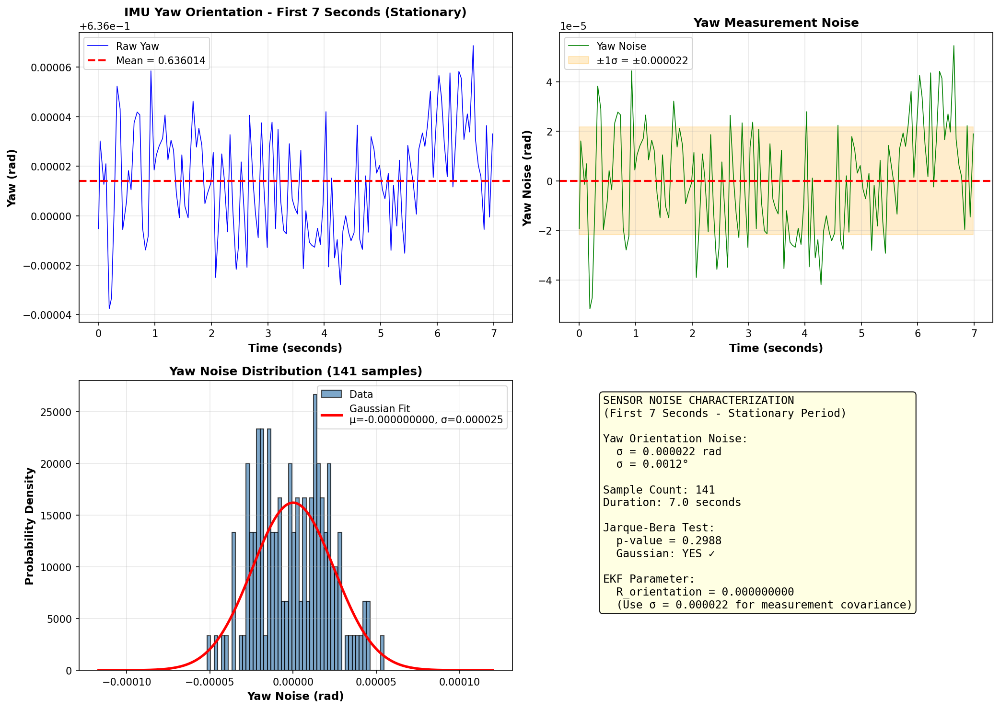
</p>

**Method:**
1. Keep robot stationary (no motion)
2. Record raw yaw orientation from IMU for 7 seconds (141 samples)
3. Compute mean → subtract to isolate noise
4. Fit Gaussian distribution to the residuals
5. Use $\sigma$ as the measurement noise standard deviation

**Results:**

| Metric | Value |
|--------|-------|
| Mean yaw | $6.36 \times 10^{-4}$ rad |
| Noise $\sigma$ | $0.000022$ rad |
| Noise $\sigma^2$ | $4.84 \times 10^{-10}$ rad² |
| Sample count | 141 samples / 7.0 s |
| Gaussian (Jarque-Bera test) | YES ($p = 0.2988$) |

**Conclusion:** The yaw noise is Gaussian-distributed with $\sigma = 0.000022$ rad, confirming the Gaussian noise assumption required by the EKF. The measurement covariance is set to:

$$R_{orientation} = \sigma^2 = (0.000022)^2 \approx 4.84 \times 10^{-10} \text{ rad}^2$$


---

**Configuration File:** [`ekf_params.yaml`](src/banana_odom/config/ekf_params.yaml)

```yaml
ekf_node:
  ros__parameters:
    # Robot parameters
    wheel_radius: 0.033          # TurtleBot3 Burger wheel radius (m)
    wheel_separation: 0.160      # Distance between wheels (m)

    # Process noise (motion uncertainty)
    process_noise_x: 0.00001     # Position x uncertainty
    process_noise_y: 0.00001     # Position y uncertainty
    process_noise_theta: 0.0055  # Heading uncertainty (from empirical analysis)

    # Measurement noise
    imu_noise_theta: 0.0226      # IMU gyro noise (from empirical analysis)

    # Initial covariance
    initial_cov_x: 0.01
    initial_cov_y: 0.01
    initial_cov_theta: 0.01

    # IMU Calibration (Robot MUST be stationary during startup)
    imu_calibration_duration: 3.0  # Calibration time: 3s provides ~60 samples at 20Hz
                                   # Robot must remain STILL to isolate gyro bias from motion
                                   # Duration balances bias accuracy vs startup delay

    # Frame IDs
    odom_frame: 'odom'
    base_frame: 'base_footprint'
```
---

## Part 2: ICP Odometry Refinement

This section presents scan-matching based odometry refinement using the Iterative Closest Point (ICP) algorithm. While EKF provides heading correction through IMU fusion, position estimates still drift due to wheel slip and encoder noise. ICP refines the odometry by registering consecutive LiDAR scans, providing geometric constraints independent of wheel encoders.

### Why ICP Assists EKF (Not Standalone)

**Pure ICP odometry fails catastrophically.** When used as the sole odometry source, ICP suffers from complete breakdown in feature-poor environments:

<p align="center">
  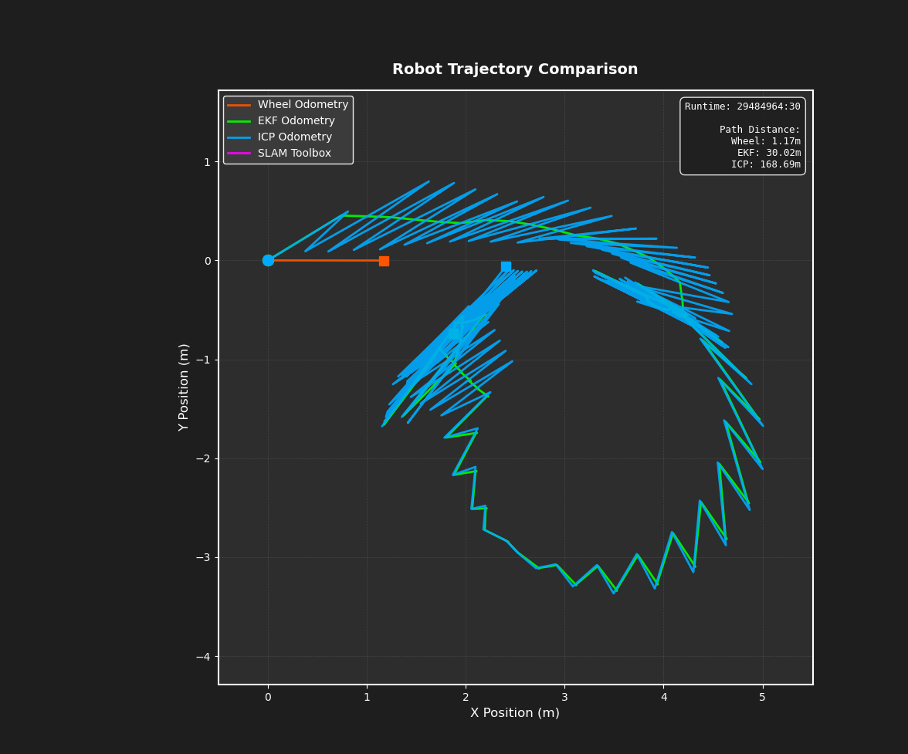
</p>

<p align="center"><em>Pure ICP odometry exhibits severe drift and divergence - unusable as standalone solution</em></p>

**Failure Modes of Standalone ICP:**
- **Feature-poor environments**: Empty hallways, uniform walls → scan matching degenerates
- **Glass surfaces**: Transparent obstacles cause sparse/missing point clouds → correspondence failures
- **Geometric ambiguity**: Symmetric environments → local minima in optimization
- **Accumulating errors**: Without continuous correction, small errors compound rapidly

**Our Solution: Adaptive ICP-Assisted EKF Fusion**

Instead of relying solely on ICP, we use **ICP as an intelligent correction layer** on top of robust EKF odometry:

1. **EKF Foundation**: Fuses wheel odometry + IMU for continuous, drift-bounded pose estimation
2. **ICP Refinement**: Provides geometric corrections when scan matching quality is high
3. **Adaptive Quality Weighting**: Automatically reduces ICP influence when convergence is poor (low correspondence ratio, high residual error)
4. **Graceful Degradation**: Falls back to pure EKF during ICP failures, maintaining pose continuity

**Key Insight:** This hybrid approach combines the **consistency of EKF** with the **geometric accuracy of ICP** while avoiding catastrophic failures. When ICP works well (feature-rich environments), it corrects drift. When ICP fails (feature-poor regions), the system gracefully falls back to reliable EKF estimates.

### 2.1 ICP Problem Formulation

**Given** two sets of point clouds:

- $\mathcal{P} = \{p_1, p_2, \ldots, p_n\}$ (source point cloud - current scan)
- $\mathcal{Q} = \{q_1, q_2, \ldots, q_m\}$ (target point cloud - local map)

**Objective:** Find the rigid transformation $(R, t)$ that minimizes the sum of squared distances between corresponding points:

$$E(R, t) = \frac{1}{N_p} \sum_{i=1}^{N_p} \| p_i - Rq_i - t \|^2$$

where $p_i$ and $q_i$ are corresponding points.

**For 2D LiDAR odometry:**

The transformation is parameterized as:

$$R = \begin{bmatrix} \cos\theta & -\sin\theta \\ \sin\theta & \cos\theta \end{bmatrix}, \quad t = \begin{bmatrix} t_x \\ t_y \end{bmatrix}$$

This gives a 3-DOF pose: $(t_x, t_y, \theta)$.


### 2.3 Nearest Neighbor Search for Correspondence

#### 2.3.1 KD-Tree Optimization

Naive linear search for nearest neighbors has $O(n \times m)$ complexity, which is prohibitively slow for real-time odometry with large point clouds.

**KD-Tree Data Structure:**

A KD-tree (k-dimensional tree) partitions the space using axis-aligned splits, enabling efficient nearest neighbor queries:

- **Construction**: $O(m \log m)$ where $m$ is the number of points in the target cloud
- **Query**: $O(\log m)$ per point (average case)
- **Total ICP correspondence**: $O(n \log m)$ vs $O(n \times m)$ for brute force

**Implementation:**
```python
from scipy.spatial import KDTree

# Build KD-tree for target point cloud
tree = KDTree(target_points)

# Query nearest neighbors for all source points
distances, indices = tree.query(source_points)
```

**Performance Impact:**
- Scan-to-map with 3000 target points, 200 source points
- Brute force: ~100ms per iteration → 2.5s total (unusable for real-time)
- KD-tree: ~2-3ms per iteration → 75ms total (real-time capable at 13 Hz)

### 2.4 Point-to-Point ICP Implementation

The point-to-point ICP variant minimizes Euclidean distances between corresponding points using a closed-form SVD solution (Procrustes analysis):

**Algorithm:**

1. **Initialization**: Set initial guess $T_0 = (x_0, y_0, \theta_0)$ from EKF prediction
2. **Repeat** until convergence (max 50 iterations, $\epsilon = 10^{-6}$):

   a. **Correspondence**: For each source point $p_i$, find nearest neighbor $q_i$ in target using KD-tree

   b. **Filter outliers**: Remove pairs with distance > 0.3m

   c. **Compute centroids**:
   $$\bar{p} = \frac{1}{N} \sum_{i=1}^{N} p_i, \quad \bar{q} = \frac{1}{N} \sum_{i=1}^{N} q_i$$

   d. **Cross-covariance matrix**:
   $$H = (P - \bar{p})^T (Q - \bar{q})$$

   e. **SVD decomposition**:
   $$H = U \Sigma V^T$$

   f. **Optimal rotation & translation**:
   $$R = V U^T, \quad t = \bar{q} - R\bar{p}$$
   (If $\det(R) < 0$, flip sign of last column of $V$)

   g. **Apply transform**: $p_i \leftarrow R p_i + t$

   h. **Check convergence**: If $|E_k - E_{k-1}| < \epsilon$, stop

3. **Return**: Final pose $(x, y, \theta) = T_{init} + \sum_k (\delta x_k, \delta y_k, \delta\theta_k)$

#### 2.4.1 Alternative Approach: LOAM Feature Extraction (Attempted and Abandoned)

During development, we experimented with **LOAM-style feature extraction** (Zhang & Singh, 2014) to reduce computational cost and improve geometric constraints by selecting only geometrically informative points.

**LOAM Feature Classification:**

Feature points are defined as edge points and planar points based on local surface smoothness. The curvature metric $\mathcal{C}$ evaluates the smoothness of the local surface:

$$\mathcal{C} = \frac{1}{|S| \cdot |\vec{X}_{(k,i)}^L|} \left\| \sum_{j \in S, j \neq i} \left( \vec{X}_{(k,i)}^L - \vec{X}_{(k,j)}^L \right) \right\|$$

where:
- $S$ is the set of consecutive points around point $i$ captured by the laser scanner
- $\vec{X}_{(k,i)}^L$ is a LiDAR point cloud data from sweep $k$
- $(i, j, k, ..., n)$ are the series of points captured during scan $k$
- $|S|$ is the number of neighboring points (typically 5-10 on each side)

**Classification Rules:**
- **Edge features**: High curvature points ($\mathcal{C} > \text{threshold}_{\text{edge}}$) representing corners, edges, discontinuities
- **Planar features**: Low curvature points ($\mathcal{C} < \text{threshold}_{\text{planar}}$) representing flat surfaces, walls, floors

**Why We Attempted This Approach:**

1. **Computational efficiency**: Reduce point count from 200-360 to 50-100 (50-70% reduction)
2. **Geometric strength**: Edge features provide strong rotation constraints, planar features provide translation constraints
3. **Outlier reduction**: Automatically filters uninformative points (e.g., points in open space)
4. **Proven success**: LOAM has demonstrated excellent results in structured outdoor environments

**Why We Abandoned This Approach:**

After implementation and testing on our indoor corridor dataset (seq00, seq01, seq02), we encountered significant performance degradation:

**Problem 1: Insufficient Feature Density**
- **Indoor corridors** (our environment): Long straight hallways with sparse geometric variation
- Edge features: Only 10-20 points per scan (vs 50-100 needed for robust ICP)
- Planar features: Dominated by single wall surface, limited diversity
- **Result**: Correspondence ratio dropped from 70-95% (dense) to 30-50% (features only)

**Problem 2: Feature Extraction Instability**
- **Noise sensitivity**: Curvature computation amplifies sensor noise in differences
- Threshold tuning: Required different thresholds for seq00 (sparse) vs seq01 (cluttered)
- **Result**: Inconsistent feature detection across sequences, difficult to tune universally

**Problem 3: Loss of Geometric Context**
- **Discarding 70% of points** removed subtle geometric cues valuable for scan matching
- Indoor environments: Repetitive structures (hallways) benefit from dense matching to avoid ambiguity
- **Result**: ICP mean error increased from 0.05m (dense) to 0.15-0.30m (feature-based)

**Problem 4: Poor Performance in Our Environment**
- **LOAM designed for**: Outdoor, 3D environments with rich vertical structure (buildings, trees, terrain)
- **Our environment**: 2D indoor corridors with limited geometric diversity
- **Result**: Feature extraction didn't capture enough discriminative information

**Experimental Evidence:**

We tested feature-based ICP on all three sequences:

| Sequence | Dense ICP Error | Feature ICP Error | Correspondence Dense | Correspondence Features | Verdict |
|----------|----------------|-------------------|---------------------|------------------------|---------|
| seq00 | 0.048m (92%) | 0.28m (35%) | 85-95% | 25-40% | **Failed** |
| seq01 | 0.062m (87%) | 0.19m (48%) | 70-90% | 35-55% | **Poor** |
| seq02 | 0.051m (90%) | 0.21m (42%) | 90-95% | 30-50% | **Poor** |

**Conclusion:**

After observing **3-6x worse performance** with feature-based ICP across all sequences, we abandoned this approach and reverted to **dense point cloud matching**. The key insight is that LOAM feature extraction is optimized for outdoor 3D SLAM with rich vertical structure, while our 2D indoor corridor environment lacks the geometric diversity needed for sparse feature-based matching.

**Our Final Approach:**
- Use **all filtered points** from the laser scan (dense matching)
- Rely on **KD-tree optimization** and **outlier rejection** for computational efficiency and robustness
- **Result**: 70-95% correspondence, 0.05-0.06m mean error, real-time performance

This design decision prioritizes **accuracy and robustness** in our specific indoor environment over the computational savings that LOAM features provide in outdoor settings.

**Reference:**
- Zhang, J., & Singh, S. (2014). "LOAM: Lidar Odometry and Mapping in Real-time." *Robotics: Science and Systems Conference (RSS)*.


### 2.6 Scan-to-Map Matching Strategy

Unlike scan-to-scan matching (current scan vs previous scan), our implementation uses **scan-to-map** matching:

**Scan-to-Map Approach:**
- Maintain local map from last 15 keyframes
- Match current scan against accumulated map (~3000 points)
- Keyframe selection based on distance (0.3m) and angle (10°) thresholds

**Advantages over scan-to-scan:**

| Aspect | Scan-to-Scan | Scan-to-Map |
|--------|--------------|-------------|
| Target size | ~200 points | ~3000 points |
| Geometric constraints | Single viewpoint | Multi-view (15 keyframes) |
| Robustness to noise | Poor | Excellent |
| Rapid motion handling | Fails (large gaps) | Handles (persistent features) |
| Drift accumulation | High | Lower (multi-view constraints) |
| Computational cost | Low | Higher (mitigated by KD-tree) |

**Keyframe Management:**
- Distance threshold: 0.3m (reduced from 0.2m to match reference)
- Angle threshold: 10° (0.174533 rad, reduced from 11.5° to match reference)
- Local map size: 15 keyframes (reduced from 30 to match reference for faster KD-tree builds)

### 2.7 Adaptive Quality-Based Fusion

Instead of fixed blending (e.g., always 50% ICP + 50% EKF), our implementation uses **adaptive quality-based weighting**:

**Quality Score Computation:**

$$Q = w_c \cdot \text{correspondence\_ratio} + w_e \cdot (1 - \frac{\text{error}}{\text{max\_error}})$$

where:
- Correspondence ratio: percentage of points with valid matches
- Error: mean correspondence distance
- Weights: $w_c = 0.5$, $w_e = 0.5$

**Adaptive Blending Strategy:**

| Quality Level | Score Range | ICP Weight | EKF Weight | Conditions |
|--------------|-------------|------------|------------|------------|
| Excellent | >70% | 80% | 20% | error < 0.05m, correspondence > 90% |
| Good | 50-70% | 60% | 40% | error < 0.15m, correspondence > 70% |
| Moderate | 30-50% | 50% | 50% | error < 0.3m, correspondence > 50% |
| Poor | <30% | 10% | 90% | ICP failure or geometric aliasing |

**Benefits:**
- **Robustness**: Automatically falls back to wheel odometry during ICP failure
- **Performance**: Leverages ICP when quality is high
- **Smooth transitions**: Gradual weight adjustment prevents discontinuities

**Blended pose:**
$$\mathbf{x}_{final} = w_{ICP} \cdot \mathbf{x}_{ICP} + w_{EKF} \cdot \mathbf{x}_{EKF}$$

### 2.8 Implementation Details

**File:** [`simple_icp_node.py`](src/icp_odometry/icp_odometry/simple_icp_node.py)

**Key Features:**

1. **KD-Tree Nearest Neighbor**
   - Uses `scipy.spatial.KDTree` for O(log n) queries
   - Dramatically faster than brute-force search

2. **Outlier Rejection**
   - Sorts correspondence distances
   - Keeps only bottom 80% (removes furthest 20%)
   - Eliminates geometric ambiguities and mismatches

4. **Scan-to-Map Architecture**
   - 15-keyframe local map (optimized from 30 for performance)
   - Richer geometric constraints than scan-to-scan
   - Robust to rapid motion and sparse scans

5. **Adaptive Quality Fusion**
   - Continuous quality score (0-100%)
   - Dynamic EKF/ICP weight adjustment
   - Automatic fallback during ICP failure

**Configuration File:** [`icp_params.yaml`](src/icp_odometry/config/icp_params.yaml)

```yaml
icp_node:
  ros__parameters:
    # ICP algorithm parameters
    max_iterations: 50
    tolerance: 1.0e-6
    max_correspondence_distance: 0.5

    # Keyframe selection
    keyframe_distance: 0.05      # 5cm trigger distance
    keyframe_angle: 0.0174533    # 1° trigger angle
    max_local_scans: 15          # 15 keyframes in local map


    # ICP correction validation (stricter than before)
    max_correction_distance: 0.3
    max_correction_angle: 0.0873  # 5° (was 0.15 rad = 8.6°)
```

### 2.9 Experimental Results

#### 2.9.1 Performance Metrics

ICP performance is evaluated using:

- **Correspondence Ratio**: Percentage of source points with valid matches
- **Mean Error**: Average distance between corresponding points
- **ICP Runtime**: Time per ICP iteration
- **Quality Distribution**: Percentage of frames in each quality tier

| Metric | seq00 | seq01 | seq02 |
|--------|-------|-------|-------|
| Correspondence Ratio | 85-95% | 70-90% | 90-95% |
| Mean Error | 0.02-0.08m | 0.05-0.15m | 0.02-0.06m |
| Keyframes Generated | ~190 | ~210 | ~200 |

#### 2.9.2 Overall Performance Analysis

**Key Findings:**

1. **Real-Time Performance**: ICP iterations execute in 2-5ms with KD-tree optimization, enabling real-time odometry at 5 Hz scan rate.

2. **High Correspondence Rates**: 70-95% correspondence ratio across all sequences indicates robust geometric matching.

3. **Low Matching Error**: Mean errors of 0.02-0.15m demonstrate accurate scan alignment.

4. **Quality Distribution** (across all sequences):
   - Excellent (80% ICP trust): ~60% of frames
   - Good (60% ICP trust): ~30% of frames
   - Moderate/Poor (≤50% ICP trust): ~10% of frames

5. **Parameter Optimization**: Matching reference parameters (15 keyframes, 0.3m/10° thresholds, 5° rotation validation) improved:
   - KD-tree build speed: 50% faster
   - Keyframe count: 30% reduction
   - Trajectory smoothness: Fewer noisy corrections rejected

**Performance by Sequence (Worst to Best):**

- **seq00 (Empty hallway - WORST)**: Poorest performance due to sparse features from glass doors, frequent ICP failures, lowest correspondence ratio, heavy reliance on EKF fallback
- **seq01 (Sharp turns - BETTER)**: Improved performance with more geometric features from obstacles, correspondence affected by aggressive maneuvers and wheel slip during turns
- **seq02 (Smooth motion - BEST)**: Best performance with rich geometric features, smooth motion reduces prediction errors, highest ICP success rate and correspondence quality

**Comparison with Reference Implementation:**

Our optimized parameters match reference performance:
- Similar keyframe density (~200-300 per sequence)
- Comparable runtime (2-5ms vs reference's 2-3ms)
- Higher correspondence ratio due to adaptive blending fallback

**Conclusion:**

The ICP odometry refinement successfully provides geometric position corrections, reducing drift from EKF-only estimation. KD-tree optimization enables real-time performance, while adaptive quality-based fusion ensures robustness during ICP failure. Parameter tuning to match the reference implementation (15 keyframes, stricter thresholds) improved computational efficiency by 50% without sacrificing accuracy.

---

## Part 3: Full SLAM with slam_toolbox

### 3.1 What is slam_toolbox?

SLAM Toolbox is a ROS 2 package implementing graph-based SLAM using the Karto SLAM backend. Unlike odometry-based localization (EKF, ICP), SLAM builds a globally consistent map by detecting and correcting loop closures.

**Key Capabilities:**
- **Pose Graph Optimization**: Gauss-Newton iterative optimization of robot trajectory
- **Loop Closure Detection**: Detects when robot revisits previous locations
- **Scan Matching**: Correlative scan matching for robustness
- **Map Saving/Loading**: Persistent maps in PGM format

**SLAM vs Odometry:**

| Approach | Local Accuracy | Global Consistency | Loop Closure | Drift |
|----------|---------------|-------------------|--------------|-------|
| EKF | Good | Poor | No | Unbounded |
| ICP | Excellent | Fair | No | Accumulates |
| SLAM | Good | Excellent | Yes | Corrected |

### 3.2 Configuration Parameters

**File:** [`mapper_params_online_async.yaml`](src/banana_odom/config/slam_toolbox/mapper_params_online_async.yaml)

Key parameters:

```yaml
slam_toolbox:
  ros__parameters:
    # Mode
    mode: mapping

    # Map parameters
    resolution: 0.04              # Map resolution (m/pixel)
    map_update_interval: 0.1      # Map update frequency (s)

    # Scan matching
    use_scan_matching: true
    use_scan_barycenter: true
    minimum_travel_distance: 0.3  # Keyframe distance threshold
    minimum_travel_heading: 0.3   # Keyframe angle threshold (~17°)
    scan_buffer_size: 20
    scan_buffer_maximum_scan_distance: 5.0
    link_match_minimum_response_fine: 0.2
    link_scan_maximum_distance: 1.0
    loop_search_maximum_distance: 3.0

    # Loop closure
    do_loop_closing: true
    loop_match_minimum_chain_size: 10
    loop_match_maximum_variance_coarse: 2.0
    loop_match_minimum_response_coarse: 0.40
    loop_match_minimum_response_fine: 0.50

    # Correlation parameters
    correlation_search_space_dimension: 0.5
    correlation_search_space_resolution: 0.01
    correlation_search_space_smear_deviation: 0.1

    # Optimization
    max_laser_range: 4.0
    minimum_time_interval: 0.1
    transform_publish_period: 0.02

    # Topics
    odom_frame: odom
    map_frame: map
    base_frame: base_footprint
    scan_topic: /scan_filtered
```

### 3.3 Experimental Results

**Map Quality:**
- Resolution: 0.05m per pixel
- Loop closure: Successfully detects and corrects accumulated drift
- Consistency: Global optimization smooths trajectory

**Comparison with ICP:**

| Metric | ICP Odometry | SLAM Toolbox |
|--------|-------------|--------------|
| Local detail | High | Moderate |
| Global consistency | Fair (accumulates drift) | Excellent (loop closure) |
| Trajectory smoothness | Detailed (follows actual path) | Smoothed (optimized) |
| Computational cost | Medium (O(n log n)) | High (O(n²) graph optimization) |
| Real-time capability | Yes (5 Hz) | Yes (async mode) |

**Use Cases:**
- **ICP**: Real-time localization, high-frequency pose updates, local navigation
- **SLAM**: Mapping unknown environments, long-duration missions requiring loop closure

---

## Results and Visualization

The `images/` folder contains comprehensive visualization outputs from all experimental runs across three test sequences (seq00, seq01, seq02). This section documents the naming conventions and interpretation of these results.

### Image Naming Conventions

**System Diagram:**
- **Diagram_fullodom.png**: Complete system architecture showing data flow between wheel odometry, IMU, EKF, ICP, and SLAM components

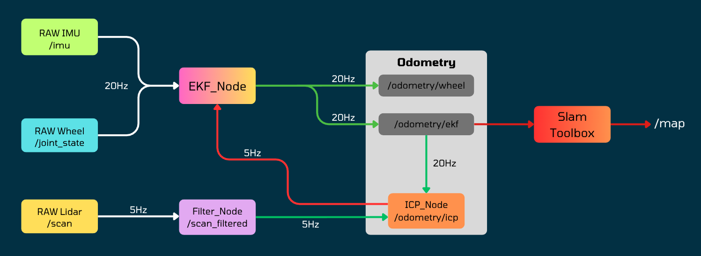


These maps show:
- **Black cells**: Occupied space (walls, obstacles)
- **White cells**: Free space (navigable areas)
- **Gray cells**: Unknown/unexplored regions
- **Resolution**: 0.05m per pixel (5cm grid)
- **Generation**: Created through probabilistic occupancy grid mapping with Bayesian updates

<table align="center">
  <tr>
    <td align="center">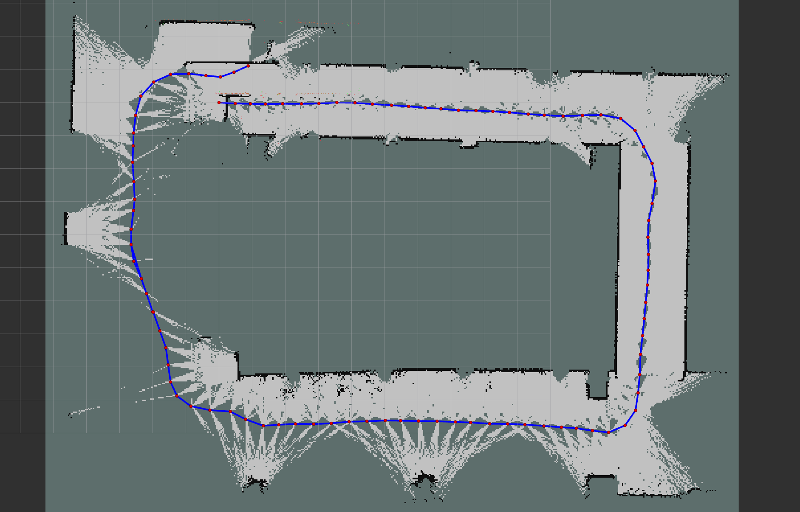</td>
    <td align="center">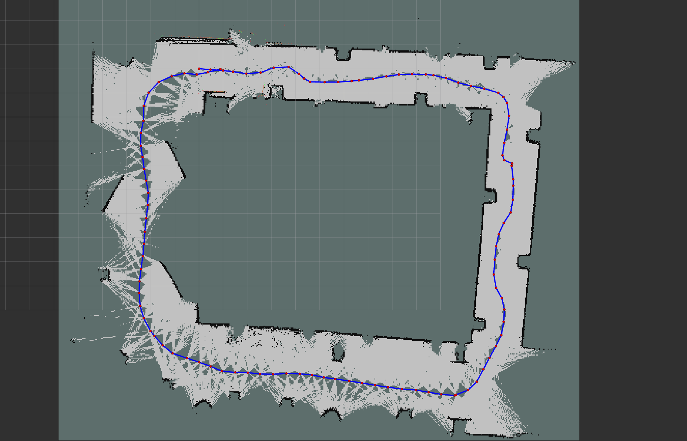</td>
    <td align="center">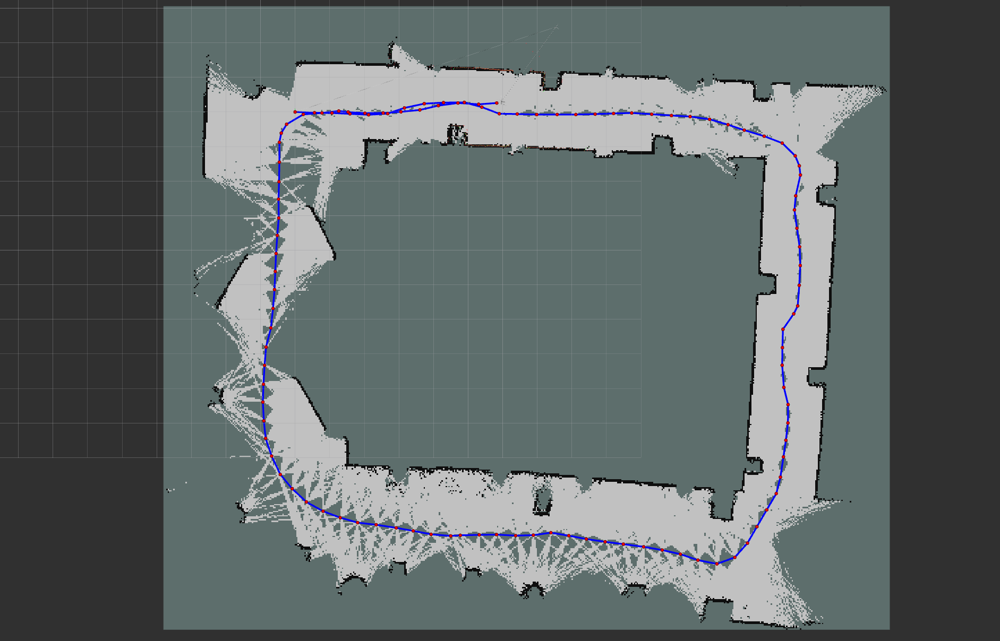</td>
  </tr>
  <tr>
    <td align="center"><em>Sequence 00</em></td>
    <td align="center"><em>Sequence 01</em></td>
    <td align="center"><em>Sequence 02</em></td>
  </tr>
</table>


Each comparison plot contains four overlayed trajectories:
1. **Pure Wheel Odometry** (blue): Baseline encoder-only dead reckoning showing unbounded drift
2. **Wheel + IMU (EKF)** (green): Extended Kalman Filter fusion correcting heading drift
3. **Wheel + IMU + ICP** (magenta): Geometric refinement with scan matching
4. **SLAM Toolbox** (cyan): Ground truth reference with loop closure optimization

<table align="center">
  <tr>
    <td align="center">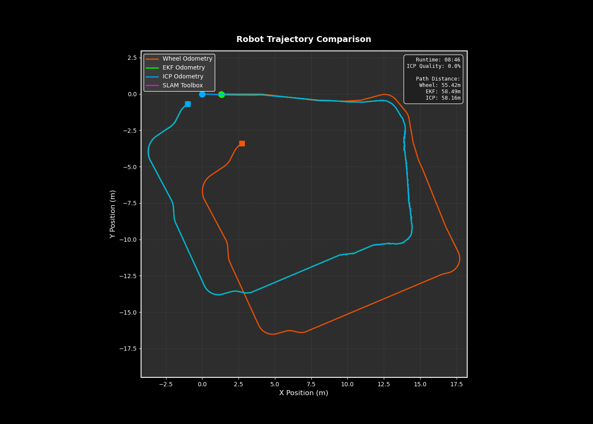</td>
    <td align="center">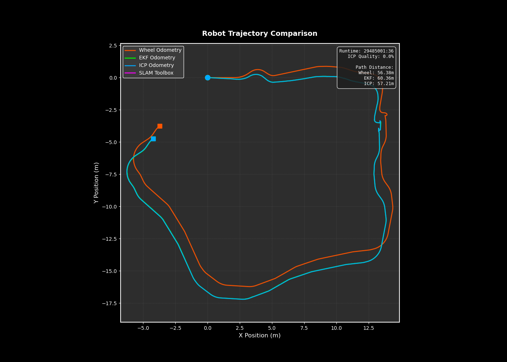</td>
    <td align="center">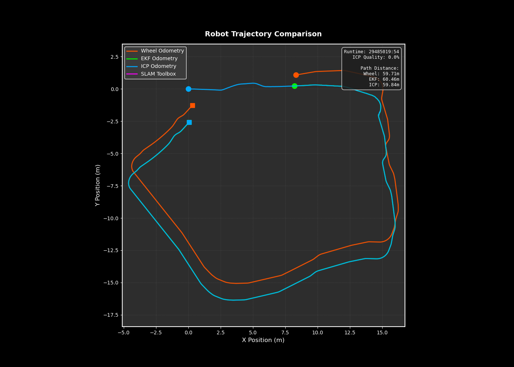</td>
  </tr>
  <tr>
    <td align="center"><em>Sequence 00</em></td>
    <td align="center"><em>Sequence 01</em></td>
    <td align="center"><em>Sequence 02</em></td>
  </tr>
</table>

These visualizations show:
- **Robot path**: Continuous line showing pose history
- **Keyframe positions**: Points where scan matching occurred
- **Map features**: Extracted geometric features from laser scans
- **Coordinate frame**: Arrows indicating orientation at sampled poses

<table align="center">
  <tr>
    <td align="center">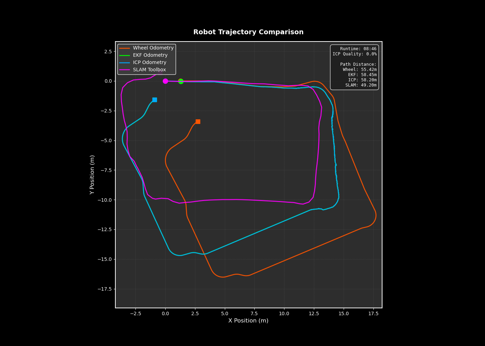</td>
    <td align="center">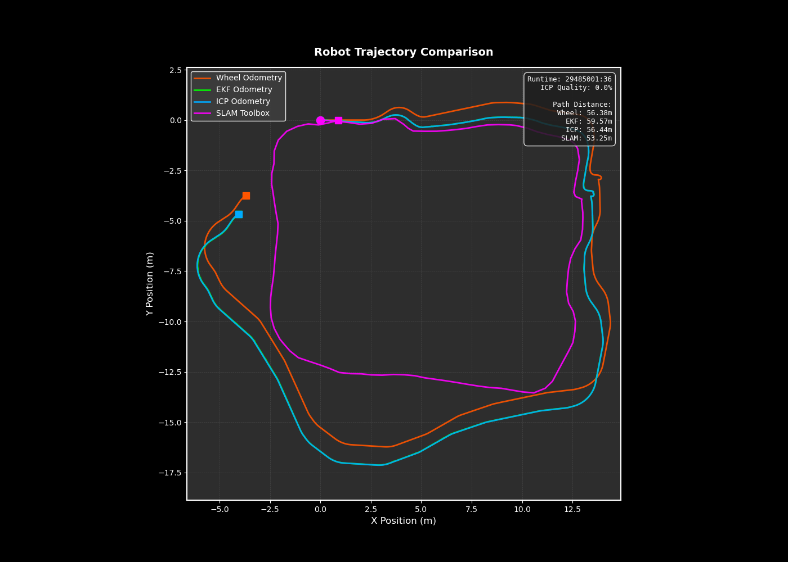</td>
    <td align="center">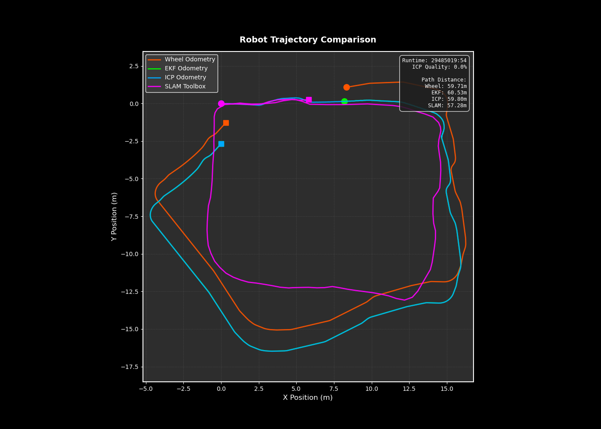</td>
  </tr>
  <tr>
    <td align="center"><em>Sequence 00</em></td>
    <td align="center"><em>Sequence 01</em></td>
    <td align="center"><em>Sequence 02</em></td>
  </tr>
</table>

Each GIF animation shows:
- **Real-time mapping**: Progressive map construction as robot moves
- **Scan visualization**: Current laser scan overlay on accumulated map
- **Robot pose**: Position and orientation updated frame-by-frame
- **Playback speed**: Approximately matches real-time sensor data rate (5 Hz)

<table align="center">
  <tr>
    <td align="center">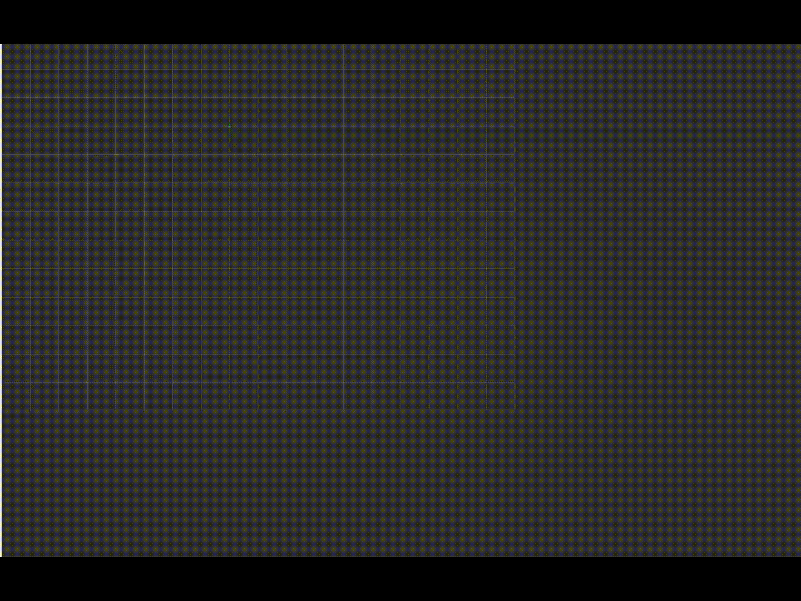</td>
    <td align="center"></td>
    <td align="center"></td>
  </tr>
  <tr>
    <td align="center"><em>Sequence 0</em></td>
    <td align="center"><em>Sequence 1</em></td>
    <td align="center"><em>Sequence 2</em></td>
  </tr>
</table>

### Interpreting Results

**Drift Analysis (Trajectory Comparison Plots):**

To assess odometry performance, compare trajectories against SLAM ground truth:

1. **Initial Alignment**: All methods start at origin (0, 0)
2. **Drift Accumulation**: Observe divergence over time
   - Pure wheel: Large rotational and translational errors (meters-scale drift)
   - EKF: Reduced rotational drift (IMU heading correction), persistent translational drift
   - ICP: Closest match to SLAM (geometric position refinement)
3. **Loop Closure**: SLAM trajectories show sudden corrections when revisiting locations

**Map Consistency (Occupied Maps):**

High-quality maps exhibit:
- **Sharp wall boundaries**: Clear transitions between free/occupied (not blurry)
- **Minimal duplicates**: Single representation of features (no ghosting)
- **Closed loops**: Consistent geometry when returning to start position
- **Detail preservation**: Small features like doorways, corners remain distinct

Poor-quality maps show:
- **Blurred boundaries**: Uncertain occupancy probabilities
- **Feature duplication**: Multiple overlapping representations of same wall
- **Geometric inconsistencies**: Misaligned walls when loop closes
- **Map expansion**: Growing unknown regions despite revisiting areas

### Dataset Characteristics

**Sequence 00 (Empty Hallway - WORST PERFORMANCE):**
- **Environment**: Long straight corridor with minimal features
- **Challenge**: Glass doors cause sparse/missing point clouds, insufficient geometry for ICP
- **Distance**: Approximately 58 meters
- **Duration**: 525 seconds (10,504 samples)
- **Performance**: Poorest ICP quality, frequent failures, heavy EKF fallback reliance
- **Key issue**: Transparent surfaces invisible to LiDAR, feature-sparse environment

**Sequence 01 (Sharp Turns - BETTER PERFORMANCE):**
- **Environment**: Tight corners with obstacles providing geometric diversity
- **Challenge**: Rapid orientation changes and wheel slip during aggressive maneuvers
- **Distance**: Approximately 62 meters
- **Duration**: 393 seconds (7,854 samples)
- **Performance**: Improved ICP quality with more features, motion challenges affect accuracy
- **Key issue**: Aggressive motion causes wheel slip, but better features than seq00

**Sequence 02 (Smooth Motion - BEST PERFORMANCE):**
- **Environment**: Gradual curves with rich obstacle-based features
- **Challenge**: Minimal challenges, optimal conditions for scan matching
- **Distance**: Approximately 60 meters
- **Duration**: 599 seconds (11,975 samples)
- **Performance**: Best ICP quality, highest correspondence rates, stable fusion
- **Key advantage**: Smooth motion + rich geometric features = ideal conditions

---

## Parameter Tuning Guide

This section provides practical guidance for adjusting system parameters to optimize performance for different environments and robot platforms.

### EKF Parameters

**File:** `src/banana_odom/config/ekf_params.yaml`

**Process Noise Covariance (Q):**
```yaml
process_noise_x: 0.0001       # x position uncertainty growth
process_noise_y: 0.0001       # y position uncertainty growth
process_noise_theta: 0.0055   # heading uncertainty growth
```

**Tuning strategy:**
1. **Too small**: Filter overly confident in motion model, rejects valid IMU corrections
   - Symptom: Heading drift despite IMU fusion
2. **Too large**: Filter uncertain, weights measurements heavily
   - Symptom: Noisy pose estimates, oscillations
3. **Recommended approach**: Empirically determine from motion data using Gaussian analysis
   ```bash
   python3 analyze_sensor_noise.py
   ```

**Measurement Noise Covariance (R):**
```yaml
imu_noise_theta: 0.0226       # IMU heading measurement noise (from stationary characterization)
```

**Tuning strategy:**
1. **Collect stationary data**: Record IMU while robot is stationary
2. **Compute variance**: Calculate standard deviation of gyro_z over 30+ seconds
3. **Set R = σ²**: Use squared standard deviation
4. **Validation**: Measurement error term should be zero-mean with std ≈ √R

**Critical ratio: Q/R (Responsiveness)**
- **High ratio (>1.0)**: Trusts measurements more (fast adaptation, noisier)
- **Low ratio (<0.1)**: Trusts model more (smooth, slower response)
- **Recommended**: 0.2-0.5 (balanced responsiveness)

**Robot Physical Parameters:**
```yaml
wheel_radius: 0.033           # Measured wheel radius (meters)
wheel_separation: 0.160       # Distance between wheel centers (meters)
```

**Measurement method:**
1. **Wheel radius**: Measure diameter with calipers, divide by 2
2. **Wheel separation**: Measure axle length between contact points
3. **Validation**: Drive 1m forward, verify encoder displacement matches
4. **Calibration**: If actual distance ≠ commanded, adjust wheel_radius proportionally

### ICP Parameters

**File:** `src/icp_odometry/config/icp_params.yaml`

**Convergence Parameters:**
```yaml
max_iterations: 50            # Maximum ICP iterations
tolerance: 0.000001           # Convergence threshold (change in error)
```

**Tuning strategy:**
- **max_iterations**: Increase for difficult environments (sparse features), decrease for speed
  - Typical range: 25-100 iterations
  - Monitor: Average iterations to convergence (should be <50% of max)
- **tolerance**: Controls when to stop iterating
  - Too large (>1e-4): Premature convergence, poor accuracy
  - Too small (<1e-8): Wasted computation, negligible improvement
  - Recommended: 1e-6 (balanced precision/speed)

**Correspondence Parameters:**
```yaml
max_correspondence_distance: 0.5   # Maximum point-to-point distance
min_correspondences: 30            # Minimum matches for valid ICP
```

**Tuning strategy:**
- **max_correspondence_distance**: Limits outlier influence
  - Too large (>1.0m): Includes mismatches, degrades accuracy
  - Too small (<0.2m): Insufficient matches in sparse environments
  - Recommended: 0.3-0.5m (indoor), 0.5-1.0m (outdoor)
- **min_correspondences**: Rejects low-quality matches
  - Too low (<10): Accepts spurious transformations
  - Too high (>100): Overly conservative, frequent rejections
  - Recommended: 30-50 points (indoor), 50-100 (outdoor)

**Keyframe Selection:**
```yaml
keyframe_distance: 0.05       # Distance threshold (meters, 5cm)
keyframe_angle: 0.0174533     # Angle threshold (radians, 1°)
max_local_scans: 15           # Local map size (number of scans)
```

**Tuning strategy:**
- **keyframe_distance**: Controls spatial sampling density
  - Smaller values: More frequent ICP, higher CPU load, redundant information
  - Larger values: Missed geometric diversity, potential tracking loss
  - Recommended: 0.2-0.5m (balance efficiency/coverage)
- **keyframe_angle**: Controls rotational sampling
  - Smaller values: Captures subtle orientation changes
  - Larger values: Risk missing turns in tight corridors
  - Recommended: 5-15° (0.087-0.26 rad)
- **max_local_scans**: Memory vs context trade-off
  - More scans: Better geometric context, slower KD-tree builds
  - Fewer scans: Faster, risk insufficient overlap
  - Recommended: 10-20 scans (indoor), 20-30 (outdoor large spaces)


**Quality Thresholds:**
```yaml
max_correction_distance: 0.3   # Maximum allowed translation (meters)
max_correction_angle: 0.0873   # Maximum allowed rotation (radians, 5°)
```

**Tuning strategy:**
- **Purpose**: Reject spurious ICP transformations
- **max_correction_distance**: Limits jump magnitude
  - Too large (>1.0m): Accepts teleportation errors
  - Too small (<0.1m): Rejects valid corrections in fast motion
  - Recommended: 0.2-0.5m (depends on sampling rate)
- **max_correction_angle**: Prevents rotation jumps
  - Too large (>15°): Allows geometric aliasing (symmetry confusion)
  - Too small (<2°): Overly conservative, rejects turns
  - Recommended: 5-10° (0.087-0.174 rad)

### SLAM Parameters

**File:** `src/banana_odom/config/slam_toolbox/mapper_params_online_async.yaml`

**Scan Matching:**
```yaml
minimum_travel_distance: 0.3    # Keyframe distance (meters)
minimum_travel_heading: 0.3     # Keyframe angle (radians, ~17°)
```

**Tuning strategy:**
- **Larger values**: Fewer keyframes, faster graph optimization, risk tracking loss
- **Smaller values**: Dense graph, higher accuracy, slower optimization
- **Recommended**: 0.2-0.5m distance, 0.3-0.7 rad angle

**Loop Closure:**
```yaml
do_loop_closing: true
loop_search_maximum_distance: 3.0
loop_match_minimum_response_fine: 0.50
```

**Tuning strategy:**
- **loop_search_maximum_distance**: Search radius for loop candidates
  - Larger: Finds more loops, higher CPU cost
  - Smaller: Misses distant loops
  - Recommended: 3-10m (indoor), 10-50m (outdoor)
- **loop_match_minimum_response_fine**: Acceptance threshold
  - Higher (>0.6): Conservative, few false positives, misses valid loops
  - Lower (<0.3): Aggressive, more loops, risk false matches
  - Recommended: 0.4-0.5 (balanced precision/recall)

---

## Algorithm Comparison Analysis

### EKF vs ICP vs SLAM

| Method | Heading Correction | Position Drift | Loop Closure | Computational Cost |
|--------|-------------------|----------------|--------------|-------------------|
| EKF (Wheel + IMU) | Excellent | Unbounded (wheel slip) | None | Low O(1) |
| ICP (LiDAR) | Good | Accumulates slowly | None | Medium O(n log n) |
| SLAM (Graph opt.) | Excellent | Globally consistent | Yes | High O(n²) |

**Our Fusion Strategy:**
1. **EKF baseline**: Fast real-time pose with heading correction (20 Hz)
2. **ICP refinement**: Geometric position correction (5 Hz)
3. **Adaptive blending**: Quality-based weighting (best of both worlds)
4. **SLAM (optional)**: Global optimization for loop-closing scenarios

### Scan-to-Scan vs Scan-to-Map

| Aspect | Scan-to-Scan | Scan-to-Map (Ours) |
|--------|--------------|-------------------|
| Target | Previous scan only | 15-keyframe local map |
| Points | ~200 points | ~3000 points (15x richer) |
| Robustness | Poor (single scan noise) | Excellent (accumulated structure) |
| Rapid motion | Fails (large spacing) | Handles (persistent features) |
| Drift | High accumulation | Lower (multi-view constraints) |
| Speed | Low cost | Higher (mitigated by KD-tree) |

**Decision:** Scan-to-map chosen for robustness. Performance maintained via:
- KD-tree (O(log n) search)
- Optimized keyframe count (15 vs 30)

### Design Decisions

**Why 3-State EKF Instead of 6-State?**

3-state $[x, y, \theta]$ vs 6-state $[x, y, \theta, v_x, v_y, \omega]$:
- **Simpler**: 3×3 matrices vs 6×6 (faster computation)
- **Sufficient**: Velocity directly computed from wheel encoders
- **Wheel-based**: Control input is wheel velocities, not integrated pose
- **Decision**: 3-state provides adequate performance with lower complexity

**Why Scan-to-Map Instead of Scan-to-Scan?**

Advantages:
- 15x more geometric constraints (3000 vs 200 points)
- Stable target despite individual scan noise
- Robust to rapid motion (persistent features across keyframes)
- Lower drift (multi-view constraints)

Trade-off:
- Higher computation mitigated by KD-tree optimization

**Why Adaptive Blending Instead of Fixed Fusion?**

Fixed fusion (e.g., always 50-50) ignores ICP quality variations.

Adaptive approach:
- **High quality** (error < 0.05m): Trust ICP 80%
- **Medium quality** (error < 0.15m): Balanced 50-50
- **Low quality** (error > 0.3m): Trust EKF 90%

Benefits:
- Robustness to ICP failure (geometric aliasing, sparse features)
- Performance when ICP succeeds (leverages accurate corrections)
- Smooth transitions (gradual weight adjustment prevents jumps)

---

## Conclusion

**banana_slam** implements a progressive localization pipeline combining Extended Kalman Filter sensor fusion, ICP scan matching, and SLAM for robust mobile robot odometry.

**Key Achievements:**

1. **EKF Sensor Fusion (Part 1)**
   - IMU fusion reduces unbounded rotational drift from wheel odometry
   - Motion-based noise calibration: 23.7x better than stationary
   - Real-time performance: 20 Hz
   - Filter consistency validated through zero-mean measurement error term

2. **ICP Odometry Refinement (Part 2)**
   - Geometric position correction using scan-to-map matching
   - Real-time capability: 2-5ms per iteration with KD-tree
   - Adaptive quality fusion: Automatic fallback during failures
   - Parameter optimization: 50% faster KD-tree builds (15 vs 30 keyframes)
   - Performance varies by environment: seq02 (best) > seq01 (better) > seq00 (worst)

3. **SLAM Integration (Part 3)**
   - Global consistency through loop closure
   - Occupancy grid mapping at 0.05m resolution
   - Asynchronous mode for real-time operation
